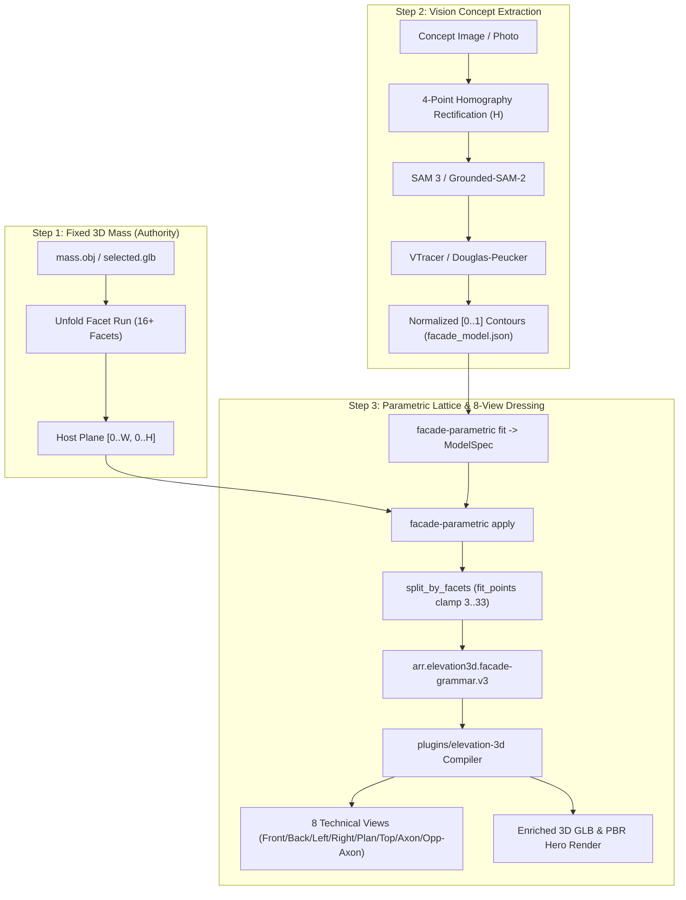

# ElevationAgent

AI-driven Architectural **Mass-to-Elevation Dressing & 8-View Technical Drawing Engine**.

---

## 🏛️ Core Philosophy: "The Mass is the Authority"
1. **대지 및 매스 절대 원칙 (The Mass is the Authority):**
   - 건물의 3D 매스(Mass)는 대지 조건, 용적률(FAR), 건폐율(BCR), 정북일조 사선제한, 도로후퇴 등 건축법규에 의해 사전 확정된 **절대 기준**입니다.
   - 인공지능이 매스의 외곽 형태나 체적을 임의로 왜곡하거나 제멋대로 생성하지 않습니다.
2. **3단계 드레싱 파이프라인 (Mass ➡️ Concept ➡️ Elevation Dressing):**
   - **Step 1 (Mass):** 확정된 3D 기준 매스 (`data/datasets/candidates/<id>/mass/mesh/mass.obj`)
   - **Step 2 (Concept):** 사용자가 제시한 생성형 파사드 컨셉 이미지 분석 (창호, 루버, 재질, 비례 분해 및 4점 호모그래피 투시 정사 보정)
   - **Step 3 (Dressing & Draw):** 매스 표면에 건축법규와 파라메트릭 규칙에 맞춰 오차 없이 입혀(Dressing), **8대 정규 건축 도면**(Front, Back, Left, Right, Axon, Opposite-Axon, Plan, Top) 및 PBR GLB 3D 모델로 출력합니다.



---

## 🧩 Component Architecture & Responsibilities

- **`tools/facade-vision/` (Vision AI Engine)**:
  - Meta SAM 3 / 3.1 & Grounded-SAM-2 (Grounding DINO + SAM 2.1) 개방형 어휘 세그멘테이션
  - 4점 호모그래피 투시 정사 보정 ($H$ 및 $H^{-1}$)으로 사진 원근 왜곡 제거
  - VTracer 무손실 벡터화 및 Douglas-Peucker 외곽선 단순화
- **`tools/facade-parametric/` (Parametric Lattice Engine)**:
  - Python 기반 격자 생성(`lattice.py`), 3D 깔때기/오큘러스 베벨 모델링(`funnel.py`)
  - 다면체 패싯 경계면 분할(`split_by_facets`) 및 점 개수 오버플로우 방지(`fit_points` 3..33 클램핑)
  - 벽체 백킹 및 폴리곤 글래스 생성(`wall_backing.py`)
- **`tools/facade-pipeline/` (Orchestrator & CLI)**:
  - `cli.mjs`: `trace`, `fit`, `apply`, `draw`, `check` 종합 실행 인터페이스
  - `perspective-workflow.mjs`: Resilient Multi-Stage Resume(누락 단계 자동 감지 복구) 및 `requireVision` 안전 정책
- **`plugins/elevation-3d/` (3D Compiler & View Renderer)**:
  - Three.js / WebGL / Canvas 기반 3D 매스 파사드 컴파일 (`enriched.glb`)
  - 건축 도면 규격(2400x2400, 9% 여백, 치수선/주석 오버레이) 8대 뷰 정밀 렌더링
  - PBR 물리 재질(Normal, Roughness, Metalness, Daylight) 검증 및 Hero 렌더링

---

## 📁 Repository Structure (Self-Contained)

```
ElevationAgent/
├── data/
│   └── datasets/              # Built-in sample masses (creative-020, creative-004)
│       └── candidates/
│           ├── creative-020/  # Standard commercial/office mass
│           └── creative-004/  # Complex pleated faceted mass
├── checkpoints/               # Neural model weights (git-ignored, helper script provided)
│   ├── README.md
│   ├── sam3.pt                # Meta SAM 3 / 3.1
│   ├── sam2.1_hiera_small.pt  # SAM 2.1
│   └── groundingdino_swint_ogc.pth # Grounding DINO
├── output/                    # Generated schemes, GLBs, and 8 elevation drawings
├── tools/
│   ├── facade-parametric/     # Python parametric lattice fitting & facet clipping
│   ├── facade-vision/         # Vision feature extraction (SAM3, SAM2, DINO, VTracer)
│   ├── facade-pipeline/       # Node.js workflow orchestrator & CLI
│   └── facade-presentation/   # Catalog and presentation sheet builders
├── plugins/
│   └── elevation-3d/          # 3D mass compilation & WebGL/Canvas rendering
├── test/                      # Comprehensive test suite (Python & TypeScript)
├── scripts/
│   └── download_checkpoints.py# Model weights verification & downloader
├── elevation-agent.json       # Repo-relative path configuration
├── package.json               # Node.js dependencies
└── README.md
```

---

## 🚀 Quick Start in Any Repository / Environment

### 1. Prerequisites
- **Node.js**: >= 18.0.0
- **Python**: >= 3.10
- **CUDA**: Optional (CPU fallback supported, CUDA recommended for SAM3/DINO)

### 2. Installation
```bash
# 1. Install Node.js dependencies
npm install

# 2. Install Python dependencies
pip install -r tools/facade-parametric/requirements.txt
pip install -r tools/facade-vision/requirements.txt
```

### 3. Model Weights Setup
If running the neural vision models (SAM 3 / Grounded-SAM-2):
```bash
python scripts/download_checkpoints.py             # find, report, link into checkpoints/
python scripts/download_checkpoints.py --verify    # sha256 against the recorded digests
python scripts/download_checkpoints.py --download  # fetch the two that are NOT gated
```
**SAM 3 is gated and no script can fetch it for you** — request access at
<https://huggingface.co/facebook/sam3>, `hf auth login`, then
`hf download facebook/sam3 --include "sam3.pt" --local-dir checkpoints`. SAM 2.1 and Grounding
DINO come from direct URLs and `--download` gets them. `checkpoints/README.md` carries the
source, size and sha256 of each file this project's drawings were made with.
*Or set environment variables:*
- `SAM3_CHECKPOINT=/path/to/sam3.pt`
- `SAM2_CHECKPOINT=/path/to/sam2.1_hiera_small.pt`
- `GDINO_CHECKPOINT=/path/to/groundingdino_swint_ogc.pth`

**The weights are not the whole of it — the SAM 3 *package* is a second thing.** `import sam3`
is not a PyPI install here: it resolves to Meta's repository (71 MB of source, separate from the
3.3 GB checkpoint). On a machine that has it installed editable, any checkout works and nothing
needs saying. On a fresh machine, give the segmenter one of the places it already looks, in this
order: `SAM3_PATH=/path/to/sam3`, `<repo>/vendor/sam3`, `<repo>/clone/sam3`, `<repo>/../clone/sam3`
— cloning Meta's repo into `vendor/sam3` is the one that needs no environment at all. The same
holds for Grounded-SAM-2. Without the package the trace still runs: `--engine classical` needs no
weights and no upstream source, and on a real photograph it is refused by the fidelity gate
(measured: `mask_iou 0.802` against a floor of 0.90, where tiled SAM 3 scores 0.924) — which is
the gate doing its job, not a broken install.

### 4. Test fixtures (only for the full test suite)

Part of the suite reads **finished e2e runs** — enriched GLBs, rendered views, validation
receipts. The five the suite names weigh about 420 MB (one of them 302 MB on its own), so
they are kept outside the repository. Point one variable at them:

```bash
ELEVATION_AGENT_FIXTURE_ROOT=/path/to/elevation-3d-e2e-results npm test
```

Measured on a clean copy of exactly what a clone carries (2026-09-22):

| | tests | pass | fail |
|---|---|---|---|
| with the fixture root | 951 | **951** | 0 |
| without it | 905 registered | 890 | 15, and **11 files stop at load** |

Eleven files ask for a fixture path while they are being imported, so the missing tree takes
the whole file rather than one test — which is why the counts do not simply differ by the
fourteen tests that name a finished run. Every one of them says what is missing and which
variable to set. **A clean clone with no fixture root is red, and that is not a defect in the
clone**: set the variable, or expect those eleven.

`npm test` is memory-bound: run it alone, and `--test-concurrency=2` keeps the browser-render
tests from stacking.

---

## 🛠️ Usage

### 1. Parametric Facade Fitting & Elevation Generation
Apply a facade grammar/trace to a mass and render all 8 drawings:
```bash
# 1. Apply facade scheme to mass
node tools/facade-pipeline/cli.mjs apply creative-020 test_broad_authentic_veil.json

# 2. Render 8 technical views and 3D GLB
node tools/facade-pipeline/cli.mjs draw creative-020
```

### 2. Vision Feature Extraction from Concept Image
Extract opening contours and lattice parameters from a concept image with 4-point homography perspective rectification:
```bash
python tools/facade-vision/trace_runner.py path/to/concept.png --engine sam3 --rectify --output output/trace.json
```

---

## ⚙️ Configuration (`elevation-agent.json`)
Paths are repo-relative by default and can be overridden via environment variables:
```json
{
  "dataset_root": "./data/datasets",
  "output_root": "./output",
  "fixture_root": "./test/fixtures"
}
```
- `ELEVATION_AGENT_DATASET_ROOT`: Override dataset directory
- `ELEVATION_AGENT_OUTPUT_ROOT`: Override output directory
- `ELEVATION_AGENT_FIXTURE_ROOT`: Override fixture directory
